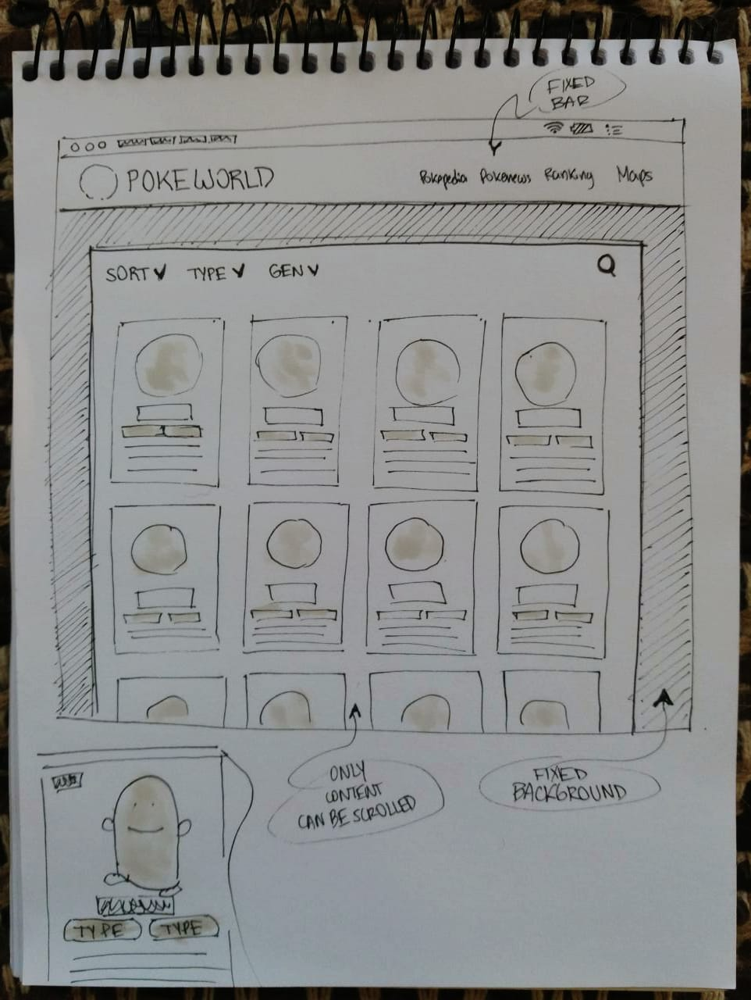
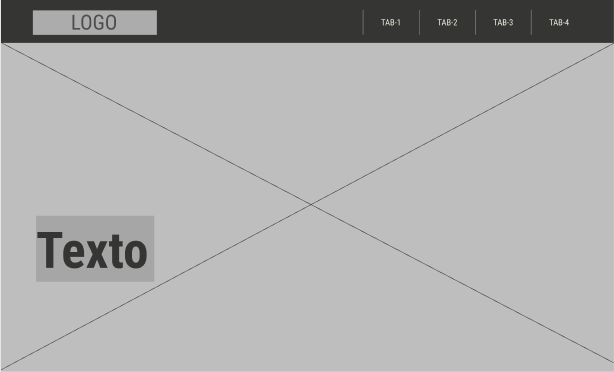
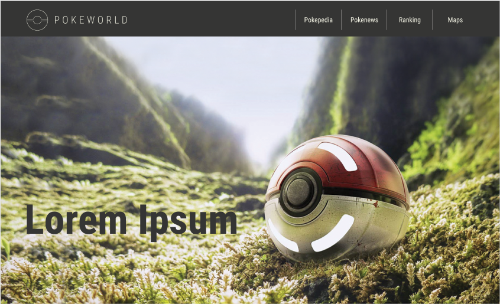
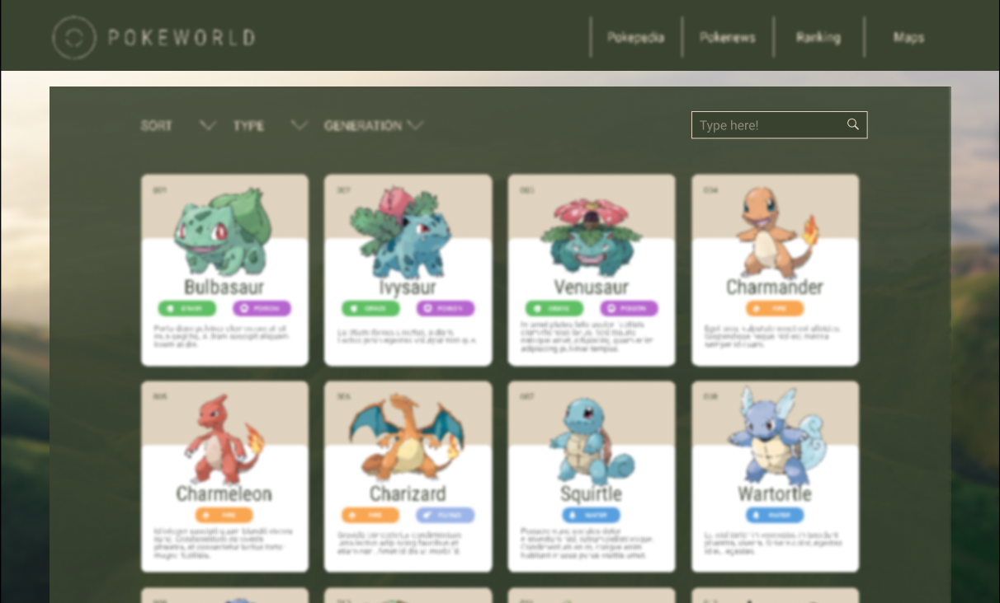
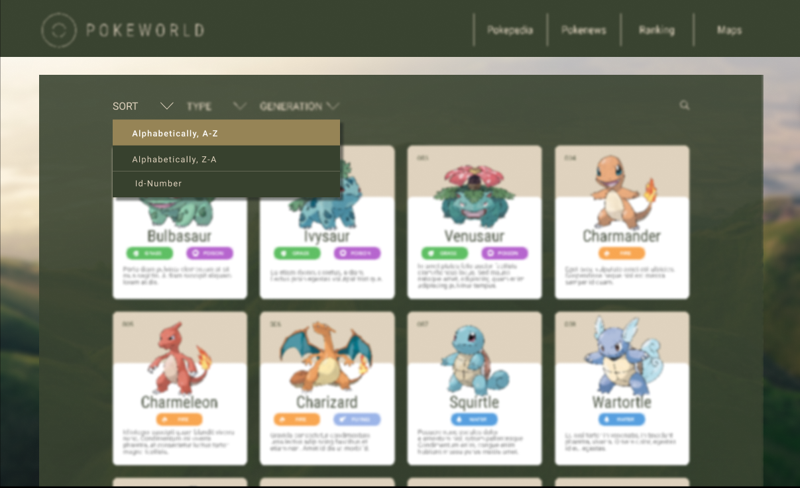

# UX

## RESEARCH

### Entrevistas con Usuarios y Expertos

    Preguntas: 
    Edad y ocupación actual.
    ¿Cuanto tiempo llevas jugando Pokemon Go? 
    ¿Que contenido consideras relevante para una web de contenidos de Pokemon GO?

    Respuestas:
    E1: 35 Años, Ingeniero de datos.
    Jugó desde el 2016 hasta el 2017, retomando de manera intermitente, posterior a este tiempo.
    Conocer que pokemones puedes poner a competir con los que ya están en los gimnasios.

    E2: 33 años, diseñador gráfico y gamer.
    Jugando desde que salió la app, aprox. 4 años.
    Ruleta de tipos: que pokemon es débil contra otros.
    Mapas: que pokemons aparecen en ciertas zonas (por actualización de juegos o migraciones) (con base de datos).

    E3: 28 años, asesor de ventas en tienda de videojuegos.
    Feed de noticias, linkeados con Nientic
    Datos de pokemon : Tipo de pokemon, debilidad, resistencia,  ataque, salud, defensa.    
    Feed con el pokemon en tendencia, más fuertes y más usados de la temporada.

### Referencias web

<https://www.pokemon.com/us/>

<https://pokeballplus.nintendo.com/es/>

<https://www.pokemongo.com/es-es/>

<https://pokemongolive.com/es/>

<https://www.nintenderos.com/>.

## IDEACIÓN

### Definición de usuario

    Jugador activo
    Paulina es una jugadora recurrente de Pokemon Go, cuenta con 50 Pokémones en su Pokédex, invierte 4 horas diarias de forma intermitente en esta aplicación.
    De manera recurrente se encuentra con el mismo problema, no cuenta con la información adecuada para evaluar sus propios Pokémones  frente a una posible batalla.

    Visitante
    Pablo no es un jugador activo, sin embargo es un fanático de Pokémon; debido que es una serie que marcó su infancia, le gustaría estar al día con las novedades del juego, nuevos Pokémones y noticias relacionadas.

### Solución a la problemática

    Poke world

    Nuestra web ofrece una pokepedia, donde nos brinda una vasta información, detalla, concisa y clara sobre cada pokemon usado en el juego, lo cual a nuestro usuario recurrente le es de gran ayuda  para poder seguir avanzando en sus siguientes batallas, y así seguir perfeccionándose como entrenador Pokémon.
    De igual manera ofrecemos información relevante, feed de noticias, comparativas, rankings, mapas y actualizaciones del juego.

### HISTORIAS DE USUARIOS  

    Se Definen 7 historias de usuarios creando un Backlog con prioridades para  coordinar durante cada sprint.

    * El proyecto decidió realizarse bajo la metodología Agiles Scrum, con Sprints semanales. Mediante la App Web Trello: <https://trello.com/b/0IoIlvbF/scrum>

### Brainstorm nombre de marca

        1era votación

        [ ] Poke manager

        [ ] Mi asistente pokemongo

        [x] Poke world III

        [ ] Pokefriends

        [x] Poke lovers I

        [ ] Gimnasios

        [ ] Batallas

        [ ] combat

        [ ] versus

        [x] life I

        [ ]  Cave

        [x]  club
        I
        [ ] trainer

        [ ]  legion

        [x] Manada Herd I

        [x] Geek I

        [x] Troop II

        2da votación

        [x] PokeWorld III

        [ ] PokeLovers I

        [ ] PokeLife

        [x] Poke Club II

        [ ] Poke Herd I

        [ ] Poke Geek

        [ ] Poke Troop I

#### Ganador: PokeWorld

## DISEÑO Y PROTOTIPADO

### Prototipado de contenido

    Realizado a mano alzada, colocamos de manera clara nuestras espectativas de la página.

    Testeo de usabilidad realizado mediante feedback en forma grupal y de squads.

### Prototipado de baja fidelidad

    Desarrollamos nuestros sketches de baja fidelidad en Balsamiq.
    Ideas en formato WEB y Movil:

    Testeo de usabilidad realizado mediante  feedback en forma grupal y con entrevistas aleatorias a personas externas de Laboratoria.

### Prototipado de alta fidelidad

#### Wireframe

    Se construyó en Figma, en tonos grises.

#### Interface

    Elegimos Figma para elaborar nuestro modelo, reflejando la paleta de colores, mood, y todo los puntos anteriormente establecidos en la etapa de Ideación.

#### Prototype

#### Testing

4 de nuestros 5 entrevistados, describieron el prototipo como:

- Elegante y discreto.
- Simple en las interacciones.
- Dinámico con los contrastes de color y tipografía.
- Fácil de ubicar, tanto los atajos como filtros.

Uno de ellos:

- Lo encontró carente de colores propios de la marca pokemon. Y a la vez le pareció sencilla en su funcionamiento.

## NOTA PARA PROGRAMADORES

- Para clonar archivo ingresar a : <https://github.com/nsquezadam/SCL014-data-lovers>

- Da clic en Fork, luego en copiar con botón Clonar o descargar.

- Ingresar a Terminal del computador, luego acceder a la carpeta donde guardarás tu repositorio y digitar: git clone
<https://github.com/YOUR-USERNAME/YOUR-REPOSITORY>
